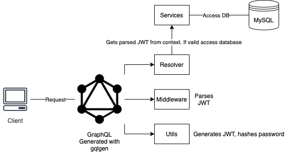

# GraphQL - JWT integration in a generated gqlgen project

This project serves as a template on how is it possible to integrate a JWT token validation in a generated graphql project using gqlgen.


## Architecture



## Usage

Run the following command to start the database service

```docker
docker-compose up --build -d
```

After the database is up and running you can start the GraphQL server using


```go
go run server.go
```

## Queries examples

```graphql
mutation createUser{
  createUser(
    input:{
      name: "Andre",
      email: "andre@gmail.com",
      password: "andre"
    }
  )
  {
    id
    name
  }
}
```

```graphql
mutation login{
  login(email: "johnny@gmail.com", password: "john0"){
    token,
    expired_at
  }
}
```

```graphql
query users{
  users {
    name,
    id,
    email,
    created_at,
    updated_at
  }
}
```

Note that if you want to access users query you have to provide an authorization header (after login is completed and you copied the JWT token)

## Contributing
Pull requests are welcome. For major changes, please open an issue first to discuss what you would like to change.
